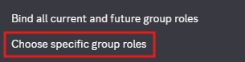
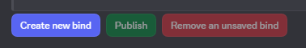
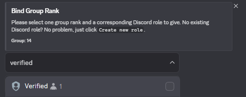

import { Aside, Steps, Tabs, TabItem } from '@astrojs/starlight/components';

## What are binds anyway?
Binds are what allow the bot to give people Discord role based on something they own, are, or are not, on Roblox.
This could be a group rank, ownership of a badge, gamepass, or other marketplace/catalog item.

## Creating binds
See the various tabs below to learn how to make some binds. These are all commands to use in your Discord server.
<Tabs>
    <TabItem label="Group (Automatic)">
        ##### Information
        This bind type will have the bot automatically hand out Discord roles to users based on the linked group.
        The Discord roles that Bloxlink will give <u>must exactly match</u> your Roblox Group names.

        ##### Making the bind
        See the ["Getting Started"](../getting_started/#connect-your-group) guide to create an
        automatically updating group binding.
    </TabItem>

    <TabItem label="Group (Manual)">
        ##### Information
        This bind type will make it so that you can give Discord roles based on a variety of group membership options.
        These options include:
        - Being in (or not in) the group
        - Having a specific rank
        - Being within a range of ranks
        - Being above, or below, a specific rank

        :::note
        The bot uses the terms `role`, `roleset`, and `rank` interchangeably to refer to a Roblox group role.
        We call it a group `rank` here because that is what they were originally called, and is most known
        by the community as such.
        :::

        ##### Making the bind
        <Steps>
            1. Type in `/bind group` and choose the command from the list
            2. Type in your group ID to the `group_id` option
                

                    
 Get your group ID 

                    Your group ID is the string of numbers inside your group URL.

                    For example, with the group URL of `https://www.roblox.com/communities/3587262/Bloxlink-Space`, the
                    group ID is `3587262`.
                

            3. Choose the `bind_mode` of "Choose specific group roles"

                

            4. Click the `Create new bind` button on the menu that the bot posts

                

            5. Select what is required to receive the role(s) you wish to give.

                There are six options to choose from:
                - "Rank must match exactly"
                - "Rank must be greater than or equal to"
                - "Rank must be less then or equal to"
                - "Rank must be between two rolesets"
                - "User MUST be a member of this group"
                - "User must NOT be a member of this group"

                 

            6. Select your Discord role(s) to give, and group ranks if applicable.

                Or, you can optionally have the bot make you a role with the "Create role" button.

                

                    
I don't see the Discord role I want!

                    The selection box only shows 25 roles by default, but if you want to choose a role that is not listed,
                    you can type in the box to search for a role!

                    
                

            7. That's all! 🎉

                You can either click `Create new bind` to make some more binds, or click
                `Publish` for the bot to save your binds.

                <Aside type="note">
                    The bot may say "This interaction failed" when you click publish.
                    This is normal, the bot will edit the message when it finishes saving.
                    Do not spam the publish button. If it takes over 1 minute to edit, please contact support.
                </Aside>
        </Steps>
    </TabItem>

    <TabItem label="Item">
        ##### Information
        This bind type will make it so that you can give Discord roles if someone owns a catalog item on Roblox.

        This type also applies to paid-access games.

        ##### Making the bind
        <Steps>
            1. Type in `/bind asset` and choose the command from the list
            2. Type in the catalog item (asset) ID to the `asset_id` option
                

                    
 Get your item ID 

                    Your item ID is the string of numbers inside the URL.

                    For example, with the item URL of `https://www.roblox.com/catalog/17521825662/Staff-Birthday-Cake-Hat`, the
                    item ID is `17521825662`.
                

            3. Click the `Create new bind` button on the menu that the bot posts

                

            4. Select your Discord role(s) to give

                Or, you can optionally have the bot make you a role with the "Create role" button.

                

                    
I don't see the Discord role I want!

                    The selection box only shows 25 roles by default, but if you want to choose a role that is not listed,
                    you can type in the box to search for a role!

                    
                

            5. That's all! 🎉

                You can either click `Create new bind` to make some more binds, or click
                `Publish` for the bot to save your binds.

                <Aside type="note">
                    The bot may say "This interaction failed" when you click publish.
                    This is normal, the bot will edit the message when it finishes saving.
                    Do not spam the publish button. If it takes over 1 minute to edit, please contact support.
                </Aside>
        </Steps>
    </TabItem>

    <TabItem label="Badge">
        ##### Information
        This bind type will make it so that you can give Discord roles if someone owns a badge on Roblox.

        ##### Making the bind
        <Steps>
            1. Type in `/bind badge` and choose the command from the list
            2. Type in the badge ID to the `badge_id` option
                

                    
 Get your badge ID 

                    Your badge ID is the string of numbers inside the URL.

                    For example, with the badge URL of `https://www.roblox.com/badges/2124581170/Welcome`, the
                    badge ID is `2124581170`.
                

            3. Click the `Create new bind` button on the menu that the bot posts

                

            4. Select your Discord role(s) to give

                Or, you can optionally have the bot make you a role with the "Create role" button.

                

                    
I don't see the Discord role I want!

                    The selection box only shows 25 roles by default, but if you want to choose a role that is not listed,
                    you can type in the box to search for a role!

                    
                

            5. That's all! 🎉

                You can either click `Create new bind` to make some more binds, or click
                `Publish` for the bot to save your binds.

                <Aside type="note">
                    The bot may say "This interaction failed" when you click publish.
                    This is normal, the bot will edit the message when it finishes saving.
                    Do not spam the publish button. If it takes over 1 minute to edit, please contact support.
                </Aside>
        </Steps>
    </TabItem>

    <TabItem label="Gamepass">
        ##### Information
        This bind type will make it so that you can give Discord roles if someone owns a gamepass on Roblox.

        ##### Making the bind
        <Steps>
            1. Type in `/bind gamepass` and choose the command from the list
            2. Type in the gamepass ID to the `gamepass_id` option
                

                    
 Get your gamepass ID 

                    Your gamepass ID is the string of numbers inside the URL.

                    For example, with the gamepass URL of `https://www.roblox.com/game-pass/1317889544/Very-important-gamepass`, the
                    gamepass ID is `1317889544`.
                

            3. Click the `Create new bind` button on the menu that the bot posts

                

            4. Select your Discord role(s) to give

                Or, you can optionally have the bot make you a role with the "Create role" button.

                

                    
I don't see the Discord role I want!

                    The selection box only shows 25 roles by default, but if you want to choose a role that is not listed,
                    you can type in the box to search for a role!

                    
                

            5. That's all! 🎉

                You can either click `Create new bind` to make some more binds, or click
                `Publish` for the bot to save your binds.

                <Aside type="note">
                    The bot may say "This interaction failed" when you click publish.
                    This is normal, the bot will edit the message when it finishes saving.
                    Do not spam the publish button. If it takes over 1 minute to edit, please contact support.
                </Aside>
        </Steps>
    </TabItem>
</Tabs>

{/* TODO: Add some component reuse so I'm not just copying and pasting the same thing 3 times. */}
