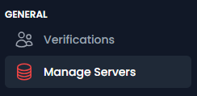
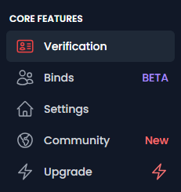
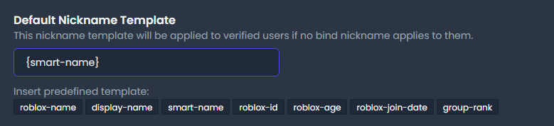
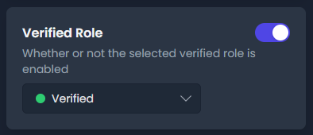
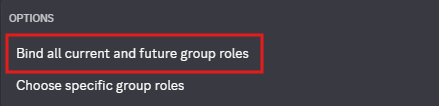
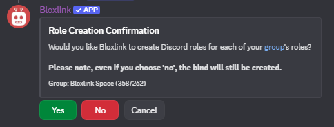

import {LinkCard, Steps} from '@astrojs/starlight/components';

## Guided Setup

<Steps>
1. Invite the bot to your server
    <LinkCard title="Invite Bloxlink"
        href="https://blox.link/invite" 
        description="Invite link for the Bloxlink bot." 
        target="_blank"
    />

2. Use the /setup command 
    
    This will guide you through setting up your nickname template, verified role name, and even link a group!

    

    
 Used the bot before? 

        In the past the bot would create your group roles for you in Discord. It does not do that
        anymore, so if you want it to do that, you will need to use the `/bind group` command described [below](#connect-your-group) instead.
    

    :::caution
    You can only set your verified role name to "Verified" through setup right now. If you wish to use another
    role, please see the manual configuration section.
    :::
    
3. That's it!

    :::caution 
    The bot will follow all settings you publish here for an hour after submitting the command. This means that 
    if you change any settings on the dashboard after using /setup, it will not use those changes until that hour has passed.
    :::
</Steps>

---

## Manual Configuration
Follow this if you want to manually do what /setup does 

<Steps>
1. Invite the bot to your server
    <LinkCard title="Invite Bloxlink"
        href="https://blox.link/invite" 
        description="Invite link for the Bloxlink bot." 
        target="_blank"
    />

2. Head to the dashboard & go to the "Manage Servers" page

    

    <LinkCard title="Server dashboard"
        href="https://blox.link/dashboard/user/servers" 
        description="The list of servers you are an admin in." 
        target="_blank"
    />

3. Click on the server you wish to configure
</Steps>

### Set the nickname template

<Steps>
1. Head to the "Verification" tab of your server dashboard 
    
    

2. Insert the desired nickname template using the options listed, or put in what you wish 

    
    
    Click [here](../nickname_templates) to view the full list of available templates.

</Steps>

### Set the verified role 
<Steps>
1. Head to the "Verification" tab of your server dashboard 

    

2. Locate the "Verified Role" option, and choose the role you wish to use 

    

    > If this is a new server, create the role you wish to use before getting to this point!
</Steps>

### Connect your group
This is what we call a **bind**, and is how we have Bloxlink assign any roles other than the 
Verified and Unverified roles!

These cannot be created from the website yet, so we need to go back to Discord first.
<Steps>
1. Head to your server on Discord
2. Type in `/bind group` and choose the command from the list
3. Type in your group ID to the `group_id` option

    

        
 Get your group ID 

        Your group ID is the string of numbers inside your group URL.

        For example, with the group URL of `https://www.roblox.com/communities/3587262/Bloxlink-Space`, the 
        group ID is `3587262`.
    

4. Choose the `bind_mode`

    To have the bot automatically manage which roles to give, select the `Bind all current and future group roles` choice.

    

5. Choose if you want the bot to create your group ranks as Discord roles

    The bot will use any Discord role that has the <u>same name</u> as a rank in your Roblox group. These could be 
    ones that you have made, or the ones that the bot makes.

    
    

    If you do not have the bot create the Discord roles now, and there is no matching role, it will create the roles as it needs them.

6. That's it!
</Steps>
