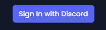
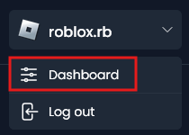
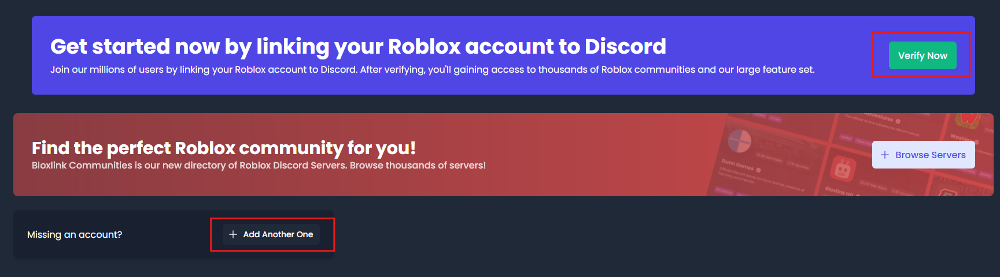
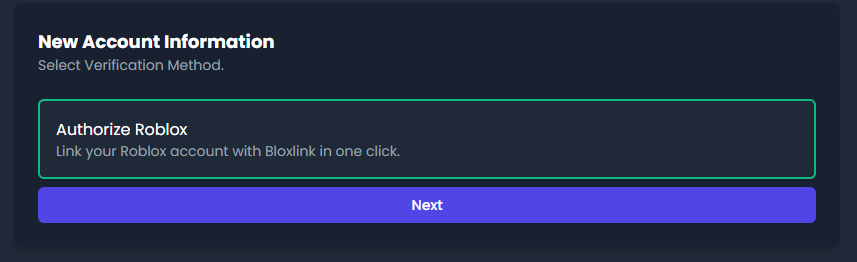
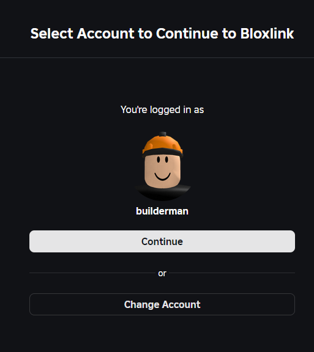
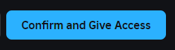
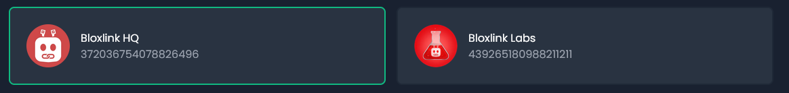

import {LinkCard, Steps} from '@astrojs/starlight/components'

Linking an account, called verification, is a core feature of Bloxlink. Learn here how to add an account!

<Steps>
    1. Head to the <a href="https://blox.link" target="_blank">Bloxlink website</a>

    2. Login with the `Sign in with Discord` button

        

        

            
It's asking me to verify my account?

            Check out the 
            [common issues](/verification/common_issues#discord-says-you-need-to-verify-your-account-in-order-to-perform-this-action) 
            page!
        

    3. Head to the <a href="https://blox.link/dashboard/user/verifications" target="_blank">account management</a> page

        1. Click your Discord username in the top right of the site
        2. Click the `Dashboard` button in the drop down
        
        

    4. Click the `Verify Now` button or the `Add Another One` button.
    
        

        Or <a href="https://blox.link/dashboard/user/verifications/verify" target="_blank">click here</a> to go there directly!

    5. Click `Next` below the `Authorize Roblox` button

        This will take you to Roblox's site. Make sure you are on the official **roblox.com** domain.
        
        

    6. Authorize Bloxlink with your Roblox Account

        1. Make sure you are using the right Roblox account then click `Next` 

            
        
            

                
Roblox says I am not allowed to use this application!

                Head to the [common issues](/verification/common_issues/#roblox-says-you-are-not-allowed-to-use-this-application) 
                page to learn how to fix this.
            

        
        2. After reading what Bloxlink requests access to, click the blue `Confirm and Give Access` button at
        the bottom of the page.

            

        After confirming, you will be taken back to Bloxlink's site to continue.

    7. Select what servers you want to use this account in

        No servers are selected by default - selected servers will be outlined in green.

        

        At the bottom of the list you can choose to `Select all servers` as well.

        

            
I don't see any servers here!

            This probably means you are accidentally using a different Discord account in your browser from 
            what you normally use!

            Head to the [common issues](/verification/common_issues#i-dont-see-any-servers-to-select) page to 
            learn how to fix this.
        

    8. Click `Confirm` at the bottom of the page

    9. You did it! 🎉

        You can now use the `/verify` command in servers with Bloxlink, or use the verification button 😁
</Steps>

