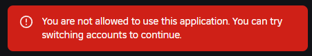
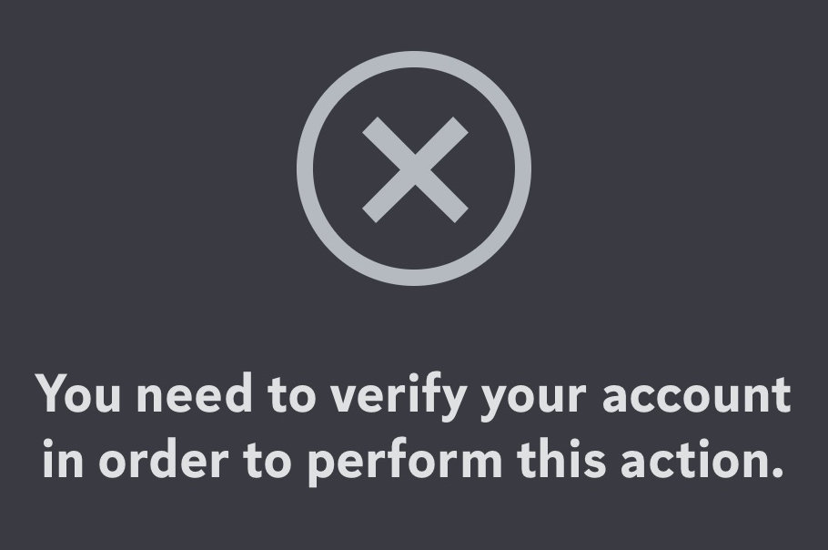

import {CardGrid, LinkCard, Steps} from '@astrojs/starlight/components'

## Roblox says "You are not allowed to use this application"

This is because Roblox requires people to be over 13 years old to be able to use this function of the site (it's called oauth!).

To fix this, if you are under 13, you will need to wait until your 13th birthday. If you are over 13, you
will need to fix the birthday set on your account. See this article from Roblox to learn how to do so!

<LinkCard 
    title='Update Roblox Account Birthday'
    href='https://en.help.roblox.com/hc/en-us/articles/360031323611'
    target="_blank"
/>
 
---

## Discord says "You need to verify your account in order to perform this action"

This is because Discord needs you to either verify your email or your phone number still.

To fix this, see these articles from Discord to learn how to request the email again, or verify your phone number.

<CardGrid>
    <LinkCard 
        title='Resend the Verification Email'
        href='https://support.discord.com/hc/en-us/articles/213219267-Resending-Verification-Email'
        target="_blank"
    />
    <LinkCard 
        title='Verify your Discord Account'
        href='https://support.discord.com/hc/en-us/articles/6181726888215-How-to-Verify-Your-Discord-Account'
        target="_blank"
    />
</CardGrid>

 

    
My email and phone number are already verified 🤙

    Make sure that in your browser you are using the <u>same</u> Discord account as the one you are using in the Discord app.

    <Steps>
        1. Go to <a href="https://discord.com/app" target="_blank">Discord's web application</a>
        2. Go to your user settings on the site, and Log Out.
        3. Sign in to Discord again 
        
            Make sure you are using the email and password for the account you are using in the app, and that
            your <u>usernames</u> match up once you log in!

        4. Log into the [Bloxlink site](https://blox.link).
    </Steps>

---

## Bloxlink says "User Restricted" when I try to verify in a server

This means that the server administrators have a setting in place that is keeping you from verifying.

This could be because the bot has detected that you are evading a ban, that you are an alt account, that your 
Roblox account is too new for the server, or another restriction is in place, such as a group lock or other
restriction set by the server admins.

To fix this, you will need to get in contact with the server admins to figure out the cause. If there is no
explanation message, you are likely detected to be ban evading - so ask the server admins to remove the bans
on any previous accounts of yours.

---

## I don't see the server I'm looking for when I verify

This probably means you are accidentally using a different Discord account in your browser from what you normally use!

Make sure that in your browser you are using the <u>same</u> Discord account as the one you are using in the Discord app.

<Steps>
    1. <a href="https://blox.link/logout" target="_blank">Log out</a> from Bloxlink
    
    2. Go to <a href="https://discord.com/app" target="_blank">Discord's web application</a>
    
    3. Go to your user settings on the site, and Log Out.
    
    4. Sign in to Discord again 
    
        Make sure you are using the email and password for the account you are using in the app, and that
        your <u>usernames</u> match up once you log in!

    5. Log into the [Bloxlink site](https://blox.link) again.

    6. Follow the process to verify once again.
</Steps>
