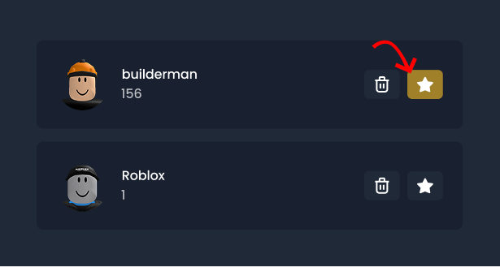
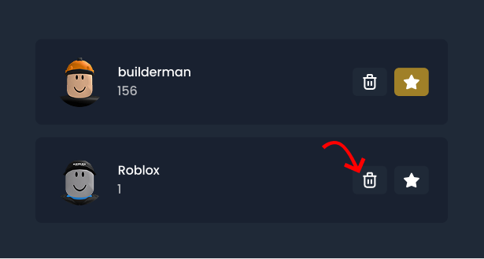

import {Steps} from '@astrojs/starlight/components'

## Set your primary account 

A primary account is your default account, it is what Bloxlink will verify you as in any new server you join
unless you choose to use another account for that server.

<Steps>
    1. Go to the <a href="https://blox.link/user/dashboard" target="_blank">Bloxlink dashboard</a>

        Sign in with Discord if you are not already
    
    2. Click the star icon next to the account you want to set as your primary account

        
    
    3. That's it!

        If your name and roles aren't updated in your servers, use the `/verify` command.
</Steps>

## Remove an account 

Don't need a Roblox account linked to you anymore? Follow the steps here to remove that account.

<Steps>
    1. Go to the <a href="https://blox.link/user/dashboard" target="_blank">Bloxlink dashboard</a>

        Sign in with Discord if you are not already
    
    2. Click the garbage can icon next to the account you want to remove

        
    
    3. That's it!

        Your nickname and roles will still stay the same in the servers you were in until you use `/verify`, or 
        you rejoin the sever, or an admin updates you.
</Steps>
